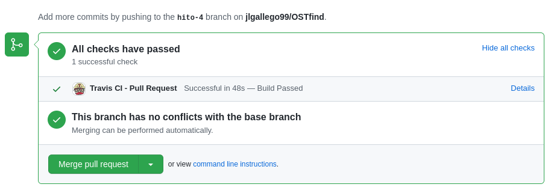

# Integración Continua
Se han configurado dos sistemas de integración continua para automatizar la ejecución de los tests al subir código a la rama principal (main), asegurando así la calidad del software ya que todo el código que se tenga en producción estará testeado. La razón de que se ejecuten estos sistemas para la rama main es porque en este proyecto se están desarrollando distintos productos mínimamente viables que solamente estarán en la rama principal cuando se completen, y cuando no lo estén se estarán desarrollando en alguna de las distintas ramas de desarrollo en la que no es necesario estar constantemente ejecutando la integración continua. Así, aseguramos que todo el código que esté en main (y por tanto, ya desarrollado), sea correcto porque ha sido testeado. 

# Travis CI
El sistema de CI principal que se usa es Travis, pionero en sistemas de CI cuya principal ventaja es que es posible usarlo de forma gratuita y es muy simple de configurar y empezar a funcionar, basta con enlazar una cuenta de Travis con el repositorio de Github y tener un fichero de configuración en el repo. Sin embargo, es limitado puesto que ofrece una cantidad limitada al mes de créditos, que cuando se gastan no permiten hacer más integraciones en ese mes. Esta es otra de las razones por las que se ha optado por realizar la integración en main, para gastar los créditos solamente cuando sea estrictamente necesario y no malgastarlos.

Para configurarlos se ha usado su documentación oficial, en concreto la relativa al lenguaje de programación que usa este proyecto: [Go](https://docs.travis-ci.com/user/languages/go/). Su configuración es muy sencilla y se encuentra en el fichero [.travis.yml](../.travis.yml). 

Lo primero que se hace es especificar el lenguaje que se va a usar, go, para que Travis en su sistema tenga el lenguaje instalado y pueda ejecutar programas escritos en él. Luego se decide especificar la rama en la que se va a ejecutar el CI, únicamente en main como ya se ha dicho, y el resto de ramas se ignorarán. Seguido de esto, se especifican las versiones del lenguaje que se quieren probar, siendo en concreto las versiones de Go 1.17.x y 1.16.x ya que en este lenguaje las dos últimas versiones siempre son las que tienen soporte. Por último se especifican las acciones que realizará el sistema de CI, que son principalmente instalar el gestor de tareas (siguiendo la recomendación de [Task](https://taskfile.dev/#/installation?id=get-the-binary)) y una vez hecho esto ya ejecutar los tests directamente sobre el código mediante la tarea del gestor.

Resumiendo, con esto tenemos un sistema de CI que se ejecuta al subir código a la rama principal (main) y testea todos los fuentes en dos versiones del lenguaje e indica si han pasado los tests. Por tanto, cuando hagamos un pull request con todo el código desarrollado que conforma un nuevo producto mínimamente viable, el sistema de CI se ejecuta para ver si podemos hacer el merge ya que todo ha pasado los tests, como podemos ver en la siguiente imagen:

# Github Actions
En el milestone anterior ya se configuraron dos workflows de CI usando Github Actions para construir los [contenedores](./contenedores.md) al hacer push a main. Se añade un nuevo workflow para aprovechar esos contenedores construidos y ejecutar los tests en ellos, para seguir aprovechando el uso de CI en Github ya que no tiene límite de créditos, estaba ya configurado de antemano y es parte del ecosistema en el que ya se tiene todo el código, por lo que resulta simple y conveniente.

Este [workflow](../.github/workflows/tests.yml) es muy parecido a los dos anteriores hechos. Corre en la versión de Linux que ofrece Github, que ya tiene docker instalado previamente por lo que no es necesario instalarselo. Lo primero que hace es hacer checkout al repositorio con la action ya vista anteriormente, lo que nos permite acceder a él. Esto es especialmente importante porque para ejecutar el docker de tests lo que hacemos es que, como no están los fuentes en el propio contenedor, se redirigen en la ejecución de este y por tanto necesitamos acceder al repo para tener esos fuentes.

Por tanto, una vez hecho el checkout lo único que queda es instalar el gestor de tareas de la misma manera que se hizo en Travis y recomienda la documentación oficial de Task. Esto se hace para aprovechar la tarea que ya se tiene en el gestor y así facilitar la ejecución del contenedor, que se realiza en el siguiente y último paso del workflow simplemente llamando al gestor de tareas.