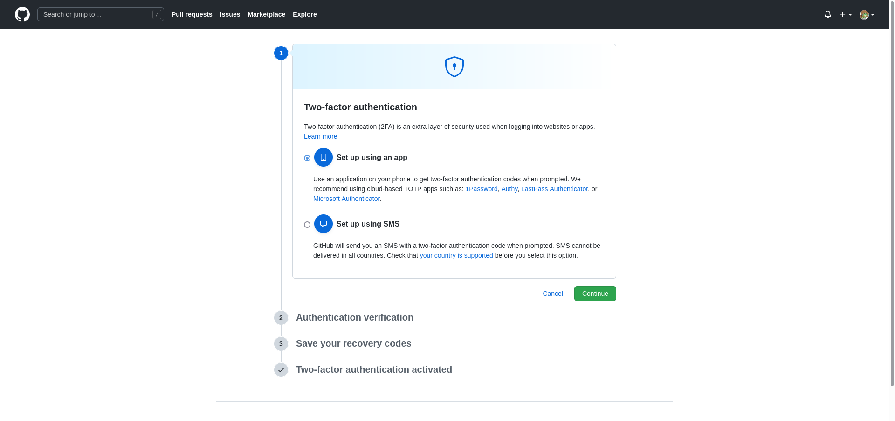

# Configuración inicial de Git
A continuación se muestran los pasos seguidos en la realización de la configuración inicial para trabajar con Git en todo este proyecto. En mi entorno uso además [oh-my-zsh](https://github.com/ohmyzsh/ohmyzsh) en el terminal para poder poner temas (en mi caso, el tema [Spaceship](https://github.com/spaceship-prompt/spaceship-prompt)) y así distinguir de forma más sencilla y con colores en el terminal el estado actual del repositorio de Git.

## Creación de par clave público/privada
Mediante este par de claves ssh se puede usar Git con Github de forma segura. Yo ya lo tenía configurado de antes, para lo cual realicé lo siguiente (siguiendo las indicaciones de la [documentación de Github](https://docs.github.com/es/authentication/connecting-to-github-with-ssh/generating-a-new-ssh-key-and-adding-it-to-the-ssh-agent)):

Crear el par clave pública/privada, el cual nos pedirá que le asignemos un email asociado y una contraseña de seguridad.
```
ssh-keygen -t ed25519 -C "jlgallego99@correo.ugr.es"
```

Este par en mi caso lo almaceno en la carpeta *.ssh* en el home de mi ordenador. Los dos primeros archivos son, respectivamente, la clave privada y la clave pública.


Ahora es necesario añadir esta clave al gestor ssh de mi entorno, para lo cual primero se inicia el agente ssh que gestionará las claves:
```
eval "$(ssh-agent -s)"
```
Y luego, una vez ejecutado el agente, se le añade la clave privada creada
```
ssh-add ~/.ssh/id_ed25519
``` 

Una vez hecho esto ya están configuradas las claves en la máquina, sin embargo es necesario ahora añadir la clave pública en mi cuenta de Github para poder trabajar de forma segura con los repositorios remotos, indicando que este ordenador (que tiene la clave privada asociada) pueda interactuar con ellos.  
Para ello, accedemos a la configuración de Github y en el apartado de claves SSH y GPG añadimos una nueva clave, en este caso la clave pública que acabamos de crear. Tendrá asociado un nombre, en mi caso el nombre de mi ordenador, y también se puede observar que tengo configurada otra clave válida para que mi Raspberry también pueda trabajar con Github.  


## Configuración del nombre y email para que aparezca en los commits
Se configura en Git, de forma global puesto que no voy a usar otra identificación, mi nombre de usuario (en la primera orden) y el email asociado a ese nombre de usuario (en la segunda orden) para que todos los commits que haga de ahora en adelante se sepa que los he hecho yo.

```
git config --global user.name "jlgallego99"
git config --global user.email jlgallego99@correo.ugr.es
```

## Perfil de Github con nombre, avatar y ciudad
Mi perfil de Github está configurado con un avatar, mi nombre completo, un nick de usuario para identificarme más fácilmente y la ciudad en la que vivo, además de que estoy estudiando en la UGR.


## Segundo factor de autenticación
En el apartado de seguridad de la configuración de Github se puede añadir un segundo factor de autenticación para la cuenta, lo cual permite una mayor seguridad. Existen dos maneras: mediante SMS y mediante una aplicación que proporcione códigos de autentificación de dos factores. Esta última es la que recomienda Github y la que vamos a utilizar.    
 

En mi caso utilizo la aplicación Authy en mi móvil, recomendada por la propia Github y que además es gratuita, para generar los códigos de autentificación. Para poder usarla con Github, se nos pide que con la app escaneemos un código QR. Entonces, Github nos da unos códigos adicionales para recuperar la cuenta en caso de algún fallo, los cuales guardamos a buen recaudo. Una vez hecho esto, ya está todo listo para usar la autentificación de 2 factores con Github y Authy.  
