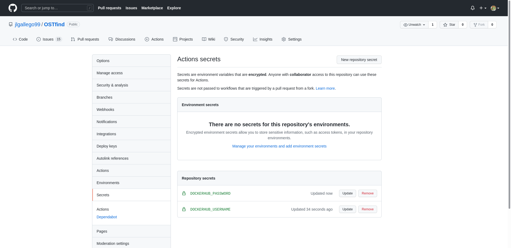
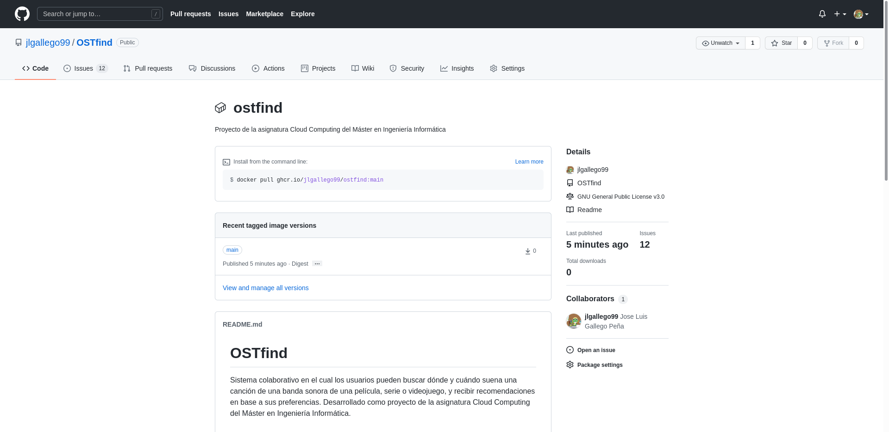

# Creación de contenedores para un entorno de pruebas

## Docker
Para crear el Dockerfile se ha seguido un proceso ordenado en el cual lo primero y más importante es elegir el contenedor base a partir del cual se va a construir el contenedor necesario para ejecutar el proyecto, y luego se instalarán los paquetes y bibliotecas necesarias para poder ejecutar los tests.

Se ha usado como guía las buenas prácticas de la [documentación de Docker](https://docs.docker.com/develop/develop-images/dockerfile_best-practices/) y los ejemplos de optimización de [erseco](https://github.com/erseco/dockerfile-optimization-examples), en el cual se pone de manifiesto que Alpine es una de las mejores opciones para crear contenedores Docker.

### Elección del contenedor base

Para elegir el contenedor base se ha optado por usar Alpine Linux debido a su bajo tamaño y a que está pensado para crear contenedores con lo justo y necesario, lo cual hará que se tenga un contenedor ligero con lo mínimo necesario para ejecutar los tests y que no se tarde mucho en crear y lanzar. Sin embargo, existen muchas versiones de [Alpine](https://hub.docker.com/_/alpine?tab=tags), y aún más, existen contenedores bases oficiales de [Go](https://hub.docker.com/_/golang?tab=tags) que también usan Alpine como base. 

En general, buscamos crear un contenedor que use la última versión estable de Alpine, la *3.14*, ya que nos garantiza tener la versión más moderna y sin problemas ya que es estable. Lo mismo con Go, buscamos la versión *1.17.3* que es la última versión estable y la que se ha usado a lo largo de este proyecto, asegurándonos de que todo va a funcionar bien en esa versión (aunque hay que tener en cuenta que serviría cualquiera de las dos versiones importantes anteriores, la 1.16 y la 1.15 porque son las que siguen recibiendo soporte y son estables). Los contenedores base de Alpine para la versión que queremos tienen un tamaño de menos de 3MB, mientras que los contenedores oficiales de Go que usan Alpine tienen un tamaño de más de 100MB, una diferencia bastante grande. 

Puesto que solo vamos a necesitar cosas básicas como el lenguaje, el gestor de tareas, una biblioteca de tests y nada más, es mejor crear un contenedor desde una imagen básica de Alpine.

Hay que tener en cuenta que el proyecto está en el lenguaje de programación Go, por lo que necesitaremos tener instalado ese lenguaje, además de las bibliotecas necesarias para testear, en este caso *Ginkgo*, y el gestor de tareas *Task*. Se ha buscado en el [repositorio de paquetes de Alpine](https://pkgs.alpinelinux.org/packages) a ver si se podía instalar usando *apk*, y efectivamente existe un paquete con la versión *1.17.3*, que es la que buscamos, por lo que podremos instalar así el lenguaje.

Sin embargo, el gestor de tareas Task no existe en el repositorio de paquetes de alpine, por lo que habría que instalarlo directamente usando curl, como dice en la [documentación oficial](https://taskfile.dev/#/installation?id=build-from-source). El resto de dependencias se instalan al ejecutar los tests, por lo que no es necesario pasar en el dockerfile ningún fichero de dependencias.

Con todo esto ya se tiene un [Dockerfile](../Dockerfile) completo y listo para poder ejecutar los tests de OSTfind. Dentro de él se encuentran comentarios sobre las decisiones tomadas en cada línea, que vienen a representar lo estudiado en este documento. Principalmente se ha buscado reducir el número de capas usando una sola instrucción *RUN* para instalar múltiples paquetes y se ha usado un usuario no privilegiado para ejecutar las tareas. Tanto el lenguaje como el gestor de tareas los debe instalar el root puesto que un usuario no root no tiene permisos para instalar paquetes con apk.

Se probó a usar la imagen de alpine oficial de Golang, sin embargo quedaba una imagen de mas de 500MB, teniendo ademas que instalar el paquete *build-base* en el dockerfile puesto que sin gcc no se puede ejecutar go. Con la imagen actual se tiene un tamaño de unos 450MB (140MB comprimida), que no he podido reducir más debido a que la mayoría de ese espacio pertenece a la instalación del lenguaje, y es necesario para ejecutar los tests. Si lo que hiciese el docker fuese ejecutar un binario, se podría hacer con una imagen super ligera en la que primero se compile y se genere un ejecutable, y luego este se copie a una imagen de scratch vacia donde simplemente se ejecute, pero no es el caso.

Es importante tener en cuenta que este contenedor no contiene los fuentes del proyecto, si no que se ejecutará a partir del repositorio de código, redirigiendo los fuentes en una ejecución del contenedor docker (que está en DockerHub), con la siguiente orden:
```
docker run -t -v `pwd`:/app/test jlgallego99/OSTfind
```
Que se puede ejecutar de forma más fácil con la orden del gestor de tareas:
```
task dockertest
```

### DockerHub y actualización automática del contenedor
El contenedor se ha subido primero a [DockerHub](https://hub.docker.com/r/jlgallego99/ostfind/tags) de forma manual. Sin embargo, lo más óptimo sería poder construir este contenedor y subirlo automáticamente a DockerHub cada vez que se haga push a main en el repositorio de Github. Para ello se ha usado una [Github Action](https://github.com/marketplace/actions/build-and-push-docker-images) en su última versión v2, siguiendo las guías oficiales de docker para hacerlo.

El [workflow](../.github/workflows/dockerhub.yml) contiene comentarios explicando lo que hace cada línea. En general está escuchando al evento push en main, que obviamente se activa cuando se suben nuevos cambios a la rama principal del repositorio de Github. Esto he decidido hacerlo así principalmente porque en la rama main siempre se va a tener el código de cada nuevo producto mínimo viable, que se asume que está testeado y funcionando, por lo que es el mejor momento para crear un nuevo contenedor y subirlo, y mientras se esté trabajando en cualquiera de las otras ramas de desarrollo no se haga nada con el contenedor.

En cada una de las las tareas que hace el workflow se usan distintas github actions con un tag determinado que identifica a un commit concreto de esa acción, esto nos asegura que es una versión que funciona, eligiendo en este caso la última por ser la más estable y utilizada. Estas tareas son: 
- Comprobar el estado del repositorio para que el propio workflow pueda acceder a él
- Hacer login en la cuenta de DockerHub
- Construir el contenedor y subirlo a DockerHub

En la documentación se nos recomendaban otras acciones que no se han puesto, como QEMU que sirve para virtualizar y construir en más plataformas, Buildx para construir imágenes multiplataforma o extraer metadatos de github para nombrar los tags, pero no es necesario puesto que solo vamos a usar docker y dockerhub y vamos a subir siempre un contenedor latest, es decir última versión, indicándoselo directamente a la acción de construir y subir. 

Con esto, se nos queda un workflow muy simple y fácil que nos permite subir el contenedor automáticamente.

Una de las acciones que hemos descrito necesita el usuario y contraseña de la cuenta de DockerHub para poder subir el contenedor, pero esto obviamente no se puede especificar en el propio fichero del workflow por temas de seguridad. Es por esto que se usan los secretos de Github, que se acceden y crean en la configuración del repositorio. 



Con esto se puede guardar información sensible y privada para usarlos en los workflows. Así, en el fichero se le indica al workflow que acceda al secreto donde está la cuenta de DockerHub para que pueda hacer login.

## Github Container Registry
Como registro alternativo y público para subir los contenedores, a parte de DockerHub, se ha decidido usar Github Container Registry por una simple razón: su simplicidad y conveniencia, ya que de por sí estamos usando Github y es un sistema en el que confiamos, por lo que tiene sentido tener ahí tanto el contenedor como el código. Además, su forma de subirlo con las Github Actions es muy parecida a la de DockerHub.

Se ha usado la [documentación](https://docs.github.com/es/actions/publishing-packages/publishing-docker-images) oficial de Github para hacer la acción que suba la imagen al GHCR. En general se tiene un workflow muy parecido al de DockerHub, cuyo evento se ejecuta igual que el anterior: cuando se hace push a la rama main, indicando que es una nueva versión del proyecto que es funcional, y por tanto tiene sentido construir el contenedor y subirlo. Por tanto, ahora se subirán a la vez dos contenedores a dos registros distintos.

Se usan las mismas acciones que en el workflow anterior, sin embargo el login ahora hay que hacerlo en GHCR, indicando la dirección del registro y el nombre y usuario de la cuenta de Github (la misma que se usa para el repositorio de código normal).

Usando el registro de paquetes de Github el contenedor se sube como un [paquete](https://github.com/jlgallego99/OSTfind/pkgs/container/ostfind), que es visible desde el propio repositorio como se puede ver en la siguiente imagen:



Contiene información de los tags, siendo el nombre de este tag main puesto que es de donde ha sacado la información del repositorio ya que el workflow se ejecuta al pasar código a main. También indica como hacer pull de la imagen, como en un repositorio de DockerHub, además de coger el readme principal del repositorio para darle una descripción al contenedor.